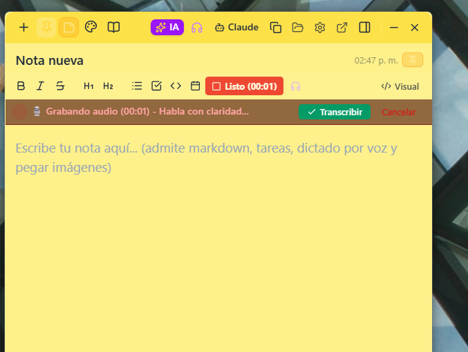
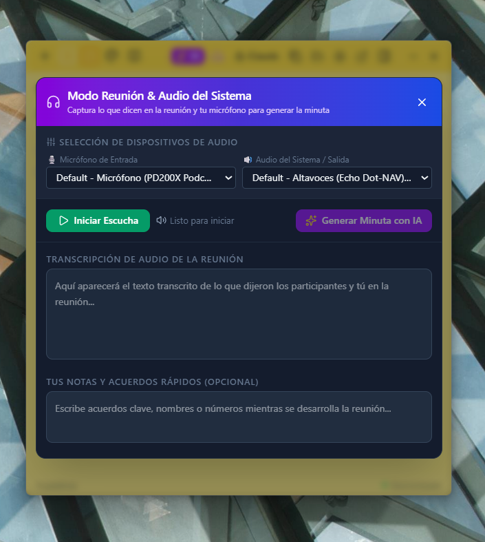
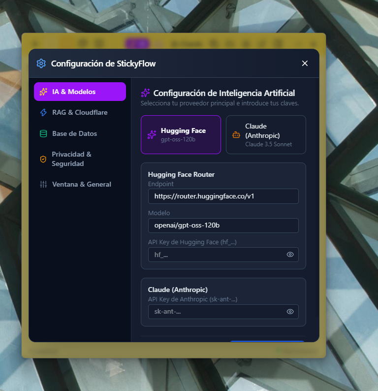
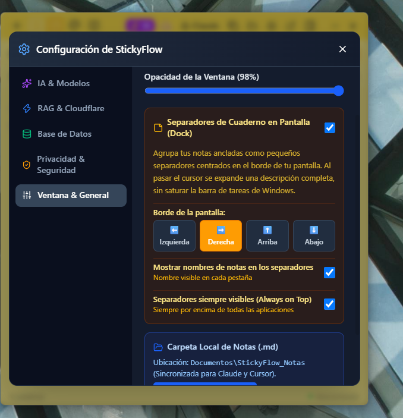

# 📌 StickyFlow — Bloc de Notas Flotante e Inteligente para Windows

<div align="center">


**Un bloc de notas de escritorio ultraligero, siempre visible y altamente personalizable, potenciado con Inteligencia Artificial (Hugging Face y Claude), dictado por voz con Whisper, actas automáticas de reuniones, dock retráctil y mini sticks flotantes estilo post-it.**

[📸 Muestras del Sistema](#-muestras-del-sistema) • [🚀 Novedades](#-novedades-de-la-actualización) • [✨ Características](#-características-destacadas) • [📥 Descarga](#-instalación-y-descarga) • [🛠️ Compilación](#-compilación-y-desarrollo) • [⌨️ Atajos](#-atajos-de-teclado) • [⚙️ Configuración de IA](#-configuración-de-ia-y-modelos)

</div>

---

## 📸 Muestras del Sistema

A continuación se presentan las capturas reales de la interfaz y funcionalidades de **StickyFlow**:

<div align="center">

### 🖥️ Vista Principal y Separadores de Cuaderno en Pantalla (Dock Lateral)
*Editor flotante siempre visible (Always-on-Top) con barra lateral de notas ancladas al borde del escritorio.*


<br/><br/>

| 🎙️ Dictado por Voz en Tiempo Real | 🎧 Modo Reunión (Audio Sistema + Micrófono) |
|:---:|:---:|
|  |  |
| **Dictado fluido con Whisper AI** (`whisper-large-v3-turbo`) directamente al cuerpo de la nota. | **Captura combinada de audio:** Graba llamadas virtuales (Meet, Teams, Zoom) y tu voz para generar actas automáticas con IA. |

<br/>

| 🤖 Asistente de IA & Modelos | ⚙️ Configuración General, Opacidad y Dock |
|:---:|:---:|
|  |  |
| **Multimodelo:** Hugging Face Router (`openai/gpt-oss-120b`) y Anthropic Claude 3.5 Sonnet con enmascaramiento de seguridad. | **Personalización:** Control de opacidad de ventana, posición del Dock (Izquierda/Derecha), etiquetas y Always-on-Top. |

</div>

---

## 🚀 Novedades de la Actualización

Esta versión incorpora importantes optimizaciones en la experiencia de uso, estabilidad y herramientas de desarrollo:

- 🗂️ **Sidebar y Contador de Notas Corregido:** Se solucionó el desfase entre las notas visualizadas y el contador numérico, mostrando la cantidad real de notas filtradas y ancladas.
- 🧹 **Deduplicación de Notas Vacías:** El sistema previene la acumulación innecesaria de notas en blanco al abrir o crear notas sucesivas.
- 📝 **Nombres Únicos para Archivos Markdown:** Generación inteligente de nombres de archivo `.md` en disco para evitar sobreescrituras accidentales.
- ⚡ **Compilación a Producción Optimizada:** Incorporación del script directo [`Compilar-Produccion.bat`](Compilar-Produccion.bat) para empaquetar el instalador NSIS y la versión portable en un solo paso.
- 📌 **Separadores de Cuaderno (Dock en Pantalla):** Pestañas fijas en el borde de la pantalla que se expanden al pasar el cursor sin saturar la barra de tareas de Windows.
- 🖼️ **Documentación Visual Integrada:** Capturas de muestra reales agregadas a la carpeta [`assets/`](assets/) y documentadas en el repositorio público.

---

## ✨ Características Destacadas

### 📌 1. Ventana Siempre Flotante y Mini Sticks Post-It
- **Modo Siempre Visible (`Always on Top`):** Mantén tus notas flotando sobre cualquier programa, juego, IDE o navegador sin perder el foco.
- **Mini Sticks de Pantalla:** Desprende cualquier nota como un mini post-it independiente con su color personalizado, título y resumen. Puedes repartir tantos como necesites en tus monitores.
- **Acceso Inmediato:** Haz clic en un mini stick flotante para abrir la aplicación principal y saltar directamente a esa nota en pantalla completa.
- **Paleta de 6 Colores:** Amarillo clásico, azul cielo, verde menta, morado lavanda, rosa pastel y modo oscuro grafito.

### 📑 2. Separadores de Cuaderno en Pantalla (Dock Lateral)
- Pequeñas pestañas discretas agrupadas en el borde de tu pantalla (izquierda o derecha).
- Al pasar el cursor por encima, se expande una descripción previa completa de la nota anclada sin necesidad de abrir la aplicación completa.
- Siempre visibles y configurables en opacidad.

### 📝 3. Editor Híbrido: Texto Enriquecido + Markdown Puro
- **Editor Visual Enriquecido (Tiptap):** Escribe con formato visual, encabezados H1-H2, negrita, cursiva, tachado, listas de tareas interactivas con checkbox (`- [ ]`), citas y bloques de código.
- **Modo Markdown Real Instantáneo:** Alterna en cualquier momento al modo código Markdown puro con un solo clic (`</> Visual` / `Markdown`) para ver o editar la sintaxis directamente sin pérdida de datos.
- **Soporte de Imágenes por Portapapeles:** Pega capturas de pantalla o imágenes directamente en el editor con `Ctrl + V`.
- **Métricas en Tiempo Real:** Visualiza el recuento de palabras y caracteres actualizados al instante en la barra inferior.

### 📅 4. Bitácora Automática con F5
- Presiona `F5` en cualquier momento dentro de la nota para insertar automáticamente una marca de fecha y hora (`📅 [2026-09-23 15:00] - `).
- Historial de actividad registrado por nota con marcas de tiempo para seguimiento de tareas, bitácoras de trabajo o diario de desarrollo.

### 🤖 5. Asistente de IA Integrado (Hugging Face Router + Claude)
- **Modelos Compatibles:** Conectado directamente a `openai/gpt-oss-120b` mediante Hugging Face Router y a **Claude 3.5 Sonnet** (`claude-3-5-sonnet-20241022`) de Anthropic.
- **Acciones Rápidas con 1 Clic:**
  - 📄 **Resumir nota:** Extrae los puntos clave y conclusiones de notas extensas.
  - 🪄 **Mejorar redacción:** Perfecciona la claridad, gramática y tono profesional del texto.
  - ☑️ **Extraer To-Do:** Convierte párrafos desestructurados en listas de tareas pendientes accionables.
  - ✍️ **Corregir ortografía y puntuación.**
- **Creación de Notas desde Ideas Sueltas:** Pega tus ideas desordenadas o apuntes rápidos y la IA redactará una nota profesional organizada con títulos, secciones lógicas y viñetas.
- **Inserción Directa:** Al terminar la respuesta de IA, puedes elegir *“Insertar en nota actual”*, *“Reemplazar contenido”* o *“Crear como nueva nota”*.
- **Integración con Claude Desktop:** Botón **"Claude"** en la barra superior para copiar al portapapeles un prompt contextualizado con la nota y toda su bitácora de actividad.

### 🎙️ 6. Dictado por Voz en Tiempo Real
- Presiona el botón de **Dictar (🎙️)**, habla de forma natural en español y tu voz se convertirá en texto al instante en la nota mediante Whisper AI (`openai/whisper-large-v3-turbo`).

### 🎧 7. Modo Reunión Inteligente (Audio de Sistema + Micrófono)
- Graba reuniones virtuales completas (Google Meet, Microsoft Teams, Zoom, Discord o llamadas web).
- Captura de forma mezclada tanto lo que hablan los demás participantes (audio del sistema) como tu propio micrófono.
- Visualiza la transcripción en directo mientras anotas acuerdos manuales.
- Al terminar la reunión, presiona **"Generar Minuta con IA"** para obtener un acta estructurada con acuerdos, compromisos, responsables y tareas pendientes.

### 📂 8. Guardado Local Transparente y Sin Bloqueo Propietario
- Todas tus notas se guardan automáticamente en tu disco duro local como archivos Markdown limpios (`.md`) con encabezados YAML en:
  ```
  📁 Documentos\StickyFlow_Notas\
  ```
- **Sin bloqueos propietarios:** Puedes abrir, sincronizar o respaldar tus notas directamente con Obsidian, VS Code, Notepad, Git o Claude Desktop.

### 🛡️ 9. Seguridad y Privacidad Absoluta
- **Filtro Automático de Tokens y Secretos:** Antes de enviar cualquier consulta de IA, el motor de seguridad enmascara automáticamente claves privadas (`hf_...`, `sk-...`), contraseñas y tokens Bearer para que jamás salgan de tu ordenador.
- **Tus Notas Son Tuyas:** No requiere registro en servidores externos ni cuentas obligatorias. La base de datos es 100% local por defecto.
- **Aislamiento de Procesos:** Electron opera con `contextIsolation: true` y `nodeIntegration: false`, impidiendo la inyección de código malicioso en el renderizador.
- **Git Seguro:** El repositorio incluye un `.gitignore` estricto que previene que notas personales, historiales de chat o claves API se suban accidentalmente a repositorios públicos.

---

## 📥 Instalación y Descarga

Tienes 3 opciones sencillas para utilizar StickyFlow en Windows:

### Opción A: Instalador Oficial Windows Setup (Recomendado)
1. Ejecuta el archivo instalador:
   ```
   release\StickyFlow-Setup-1.0.0.exe
   ```
2. Sigue el asistente de instalación. Creará accesos directos automáticos en el **Escritorio** y en el **Menú Inicio**.
3. Permite elegir la carpeta de instalación y preserva tus notas aunque decidas desinstalar la app.

### Opción B: Versión Portable (Sin instalación)
- Lleva la aplicación en una memoria USB o ejecútala en cualquier PC sin necesidad de privilegios de administrador:
  ```
  release\StickyFlow-Portable.exe
  ```

### Opción C: Inicio Instantáneo sin Esperas (0.2s)
- Si deseas que la app abra al instante sin descompresión temporal:
  ```
  Abrir-StickyFlow.bat
  ```
  *(O mediante el script en segundo plano `StickyFlow-Silencioso.vbs`)*

---

## 🛠️ Compilación y Desarrollo

Si deseas compilar o personalizar StickyFlow por tu cuenta:

### Requisitos Previos
- [Node.js](https://nodejs.org/) (versión 18 o superior)
- npm (incluido con Node.js)

### 1. Instalación de dependencias
```bash
git clone https://github.com/hlo2109/StickyFlow.git
cd aplicacion_notas
npm install
```

### 2. Ejecutar en modo desarrollo
```bash
# Modo concurrente (Vite + Electron con recarga en vivo):
npm start

# O ejecución directa de Electron:
npm run electron:dev
```

### 3. Compilar a Producción
Puedes utilizar el script para Windows:
- Haz doble clic en [`Compilar-Produccion.bat`](Compilar-Produccion.bat)

O ejecutar directamente desde la terminal:
```bash
# Compilar Instalador Oficial (.exe) y Versión Portable a la vez:
npm run build:all

# O si solo deseas el Instalador Setup NSIS:
npm run build:installer

# O si solo deseas el ejecutable Portable autónomo:
npm run build:portable
```

---

## ⌨️ Atajos de Teclado

| Atajo | Acción |
|---|---|
| `Ctrl + N` | Crear una nueva nota en blanco |
| `Ctrl + B` | Mostrar u ocultar el panel lateral de notas |
| `F5` | Insertar marca de fecha y hora para bitácora (`📅 [YYYY-MM-DD HH:MM] - `) |
| `Ctrl + B` *(en texto seleccionado)* | Aplicar formato **Negrita** |
| `Ctrl + I` *(en texto seleccionado)* | Aplicar formato *Cursiva* |
| `Ctrl + V` | Pegar texto o **imágenes directamente del portapapeles** |

---

## ⚙️ Configuración de IA y Modelos

Para utilizar las funciones de Inteligencia Artificial:

1. Abre StickyFlow y haz clic en el icono de **Ajustes (⚙️)** en la cabecera.
2. En la pestaña **"IA & Modelos"**:
   - **Hugging Face (Recomendado):**
     - Endpoint por defecto: `https://router.huggingface.co/v1`
     - Modelo por defecto: `openai/gpt-oss-120b`
     - Pega tu API Key de Hugging Face (`hf_...`).
   - **Anthropic Claude (Opcional):**
     - Modelo por defecto: `claude-3-5-sonnet-20241022`
     - Pega tu clave de Anthropic (`sk-ant-...`).
3. En la pestaña **"RAG & Cloudflare"** *(opcional)*:
   - Configura tu cuenta de Cloudflare Vectorize para sincronización semántica de notas.
4. Presiona **"Guardar Ajustes"**. Las claves quedan guardadas localmente de forma segura en tu equipo (`%APPDATA%\StickyFlow\stickyflow\settings.json`).

---

## 📄 Licencia

Este proyecto está bajo la Licencia **MIT** — Siéntete libre de utilizarlo, modificarlo y compartirlo libremente.

<div align="center">

Hecho con ❤️ para elevar la productividad diaria en el escritorio.

</div>
